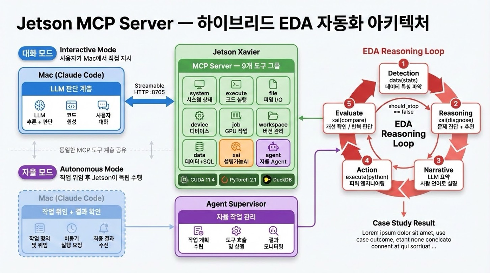

# Jetson Xavier MCP Server

NVIDIA Jetson Xavier의 CUDA/GPU 자원을 [Claude Code](https://claude.ai/code)에서 원격으로 활용할 수 있는 [MCP(Model Context Protocol)](https://modelcontextprotocol.io/) 서버입니다.

## Architecture



**하이브리드 설계** — 두 가지 운영 모드가 동일한 9개 MCP 도구 계층을 공유합니다:

- **대화 모드 (Interactive)**: Mac Claude Code가 사용자 지시에 따라 Jetson MCP 도구를 원격 호출 (Streamable HTTP :8765)
- **자율 모드 (Autonomous)**: `agent(submit)`으로 작업을 위임하면 Jetson의 Claude Code CLI가 독립적으로 EDA 루프를 수행하고 결과를 기록

## EDA Reasoning Loop

이 서버의 핵심 가치는 **반복적 EDA 자동화**입니다.

```
Detection ─── data(stats)로 데이터 특성 파악
    ↓
Reasoning ─── xai(diagnose)로 문제 진단 + 피처 엔지니어링 추천
    ↓
Narrative ─── LLM이 진단 결과를 사람 언어로 요약
    ↓
Action ────── LLM이 추천 기반 피처 엔지니어링 코드 생성 → 재학습
    ↓
Detection ─── xai(compare)로 개선 확인 → 반복 또는 중단
```

### Case Study: CNC Tool Wear Prediction

University of Michigan CNC Mill 데이터셋 (17,520 rows, 48 sensors)으로 실증:

| 반복 | 피처 | 정확도 | 주요 조치 |
|------|------|--------|-----------|
| **Iter 0** (Baseline) | 11개 (raw) | 46.32% | 원본 데이터 그대로 학습 |
| `xai(diagnose)` | - | - | 다중공선성 14쌍, 미사용 30컬럼, 클래스 불균형 감지 |
| **Iter 1** (Engineered) | 33개 | 84.87% | 다중공선성 제거 + StandardScaler + class_weight |
| **Iter 2** (Autonomous Agent) | - | **92.04%** | experiment_id 제거 + 원핫인코딩 + BatchNorm+Dropout MLP |

**+45.72%p 개선** — 자율 Agent가 data leakage 감지, 원핫인코딩, BatchNorm+Dropout 등을 자동으로 수행.

## Why Two Python Versions?

JetPack의 의존성 관리가 핵심입니다.

| Runtime | Python | Reason |
|---------|--------|--------|
| **MCP Server** | 3.10 (venv) | MCP SDK requires `python >= 3.10` |
| **PyTorch/CUDA** | 3.8 (system) | NVIDIA JetPack R35.6.1 wheel은 cp38 전용 |

시스템 Python(3.8)을 업그레이드하면 JetPack ↔ CUDA ↔ cuDNN ↔ TensorRT ↔ PyTorch 간 의존성이 깨집니다. **절대 변경하지 마세요.**

## Requirements

### Jetson Xavier
- JetPack R35.x (L4T R35)
- CUDA 11.4
- Python 3.8 (system) + Python 3.10 (`/usr/local/bin/python3.10`)
- PyTorch (installed via NVIDIA JetPack wheel for cp38)

### Client (Mac/Linux)
- [Claude Code](https://claude.ai/code) or any MCP client

## Quick Start

### 0. Configuration

배포 전에 `deploy.sh`를 열어서 **상단 2개 변수를 본인 환경에 맞게 수정**하세요:

```bash
# deploy.sh 상단
JETSON_HOST="YOUR_JETSON_IP"       # ← Jetson의 IP 주소
JETSON_USER="YOUR_USERNAME"        # ← Jetson의 사용자명
```

SSH 키 인증도 미리 설정해야 합니다:

```bash
ssh-copy-id <user>@<jetson-ip>
```

### 1. Deploy to Jetson

```bash
chmod +x deploy.sh
./deploy.sh
```

Or manually:

```bash
scp jetson_mcp_server.py requirements.txt <user>@<jetson-ip>:~/mcp-server/
ssh <user>@<jetson-ip>
cd ~/mcp-server
/usr/local/bin/python3.10 -m venv venv
venv/bin/pip install -r requirements.txt
venv/bin/python3 jetson_mcp_server.py --port 8765
```

### 2. Connect from Claude Code

```bash
claude mcp add jetson-xavier --transport streamable-http http://<jetson-ip>:8765/mcp
```

Or add to `.mcp.json`:

```json
{
  "mcpServers": {
    "jetson-xavier": {
      "type": "streamable-http",
      "url": "http://<jetson-ip>:8765/mcp"
    }
  }
}
```

### 3. Use in Claude Code

Just ask naturally:

- *"Jetson GPU 상태 확인해줘"*
- *"CNC 센서 데이터 분석해줘"*
- *"XAI로 모델 학습 결과 진단해줘"*

## Available Tools (9 Groups)

모든 도구에 `compact: bool` 파라미터 지원 (토큰 50-70% 절감).

### 1. `system` — 시스템 상태
| Action | Description |
|--------|-------------|
| `info` | OS, CPU, 메모리, 디스크, 업타임 |
| `gpu` | CUDA/GPU 상태, tegrastats, JetPack 버전 |
| `python` | Python 버전, ML 패키지, CUDA 상태 |
| `ping` | Health check |
| `processes` | 프로세스 목록 (filter 지원) |

### 2. `execute` — 코드 실행
| Action | Description |
|--------|-------------|
| `shell` | 셸 커맨드 실행 (보안 차단 포함) |
| `python` | Python 3.8 + CUDA 코드 실행 |
| `benchmark` | CUDA 행렬 연산 벤치마크 |

### 3. `file` — 파일 I/O
| Action | Description |
|--------|-------------|
| `read` | 파일 읽기 (바이너리 감지, 1MB 제한) |
| `write` | 파일 쓰기 (디렉토리 자동 생성) |

### 4. `device` — 디바이스 관리
| Action | Description |
|--------|-------------|
| `fan` | 팬 프로파일 조회/변경 (quiet/cool/aggressive) |
| `install` | JetPack 호환 패키지 설치 |
| `packages` | 호환 패키지 목록 |

### 5. `job` — 비동기 작업 관리
| Action | Description |
|--------|-------------|
| `submit` | 백그라운드 작업 제출 (자동 팬 제어) |
| `check` | 작업 상태 확인 / 전체 목록 |
| `result` | 완료된 작업 결과 조회 |
| `log` | 실행 로그 조회 |

### 6. `workspace` — 데이터 버전 관리
| Action | Description |
|--------|-------------|
| `init` | 워크스페이스 초기화 |
| `status` | 현재 상태 조회 |
| `list` | 파일 목록 |
| `fork` / `diff` / `info` / `delete` | 버전 관리 |

### 7. `data` — 데이터 I/O + SQL 분석
| Action | Description |
|--------|-------------|
| `upload` | Mac → Jetson 파일 업로드 (text/base64) |
| `fetch` | URL 데이터 다운로드 |
| `stats` | 기본 통계 (shape, dtypes, nulls, describe) |
| `query` | DuckDB SQL 쿼리 |
| `ingest` | CSV/Parquet → DuckDB 적재 |

### 8. `xai` — 설명가능AI + EDA 반복 루프
| Action | Description |
|--------|-------------|
| `explain` | 종합 분석 (상관관계 + 이상치 + 분포 + 자연어 요약) |
| `correlate` | 컬럼 간 상관관계 분석 (다중공선성 경고) |
| `outliers` | IQR 기반 이상치 탐지 + 영향도 분석 |
| `profile` | 데이터 프로파일링 (분포, 편향, 결측 패턴) |
| `trace` | 학습 결과 해석 (loss/accuracy 추세, 혼동행렬, 수렴 판단) |
| `diagnose` | **학습 결과 + 데이터 특성 종합 진단** (피처 엔지니어링 추천) |
| `compare` | **반복 학습 비교** (정확도 추이, 중단 판단) |

### 9. `agent` — 자율 EDA Agent
| Action | Description |
|--------|-------------|
| `submit` | 새 EDA 작업 제출 (백그라운드 실행) |
| `status` | 작업 상태/진행률 확인 |
| `result` | 완료된 작업의 보고서 조회 |
| `list` | 전체 작업 목록 |
| `cancel` | 실행 중인 작업 취소 |

**자율 모드 사용법**:
```
"CNC 데이터 EDA를 Jetson에 위임해줘"
→ agent(submit, task="CNC EDA", dataset="raw/cnc_mill_real.csv")
→ 외출
→ agent(result, task_id="agent_xxx") 로 결과 확인
```

Jetson의 Claude Code CLI가 MCP 도구를 자율적으로 호출하며 반복 EDA를 수행합니다.
중단 기준: 정확도 ≥95%, 2회 연속 <1%p 개선, 최대 5회 반복.

## Fan Cooling Control

| Profile | Description | Use Case |
|---------|-------------|----------|
| `quiet` | 50°C부터 팬 시작, 유휴 시 정지 | 유휴/저부하 |
| `cool` | 35°C부터 팬 시작 | 일반 운영 |
| `aggressive` | 팬 항상 동작, 50°C에서 최대 속도 | AI 학습/추론 |

`job(submit)`으로 작업을 제출하면 자동으로 `aggressive` 모드로 전환 후 완료 시 복귀합니다.

## Systemd Service

```bash
sudo systemctl status jetson-mcp    # Status
sudo journalctl -u jetson-mcp -f    # Logs
sudo systemctl restart jetson-mcp   # Restart
```

## Tested Environment

| Component | Version |
|-----------|---------|
| Jetson Xavier | AGX Xavier |
| JetPack | R35.6.1 |
| CUDA | 11.4 |
| cuDNN | 8.6.0 |
| TensorRT | 8.5.2 |
| PyTorch | 2.1.0a0+nv23.06 (cp38) |
| MCP SDK | 1.26.0 |
| Python (MCP) | 3.10.13 |
| Python (System) | 3.8.10 |

## Roadmap

- [x] 9개 그룹 도구 (system, execute, file, device, job, workspace, data, xai, agent)
- [x] XAI 설명가능AI 계층
- [x] EDA 반복 루프 (diagnose → engineer → compare)
- [x] DuckDB SQL 분석 엔진
- [x] 비동기 작업 큐 + 자동 팬 제어
- [x] compact 모드 (토큰 50-70% 절감)
- [x] 자율 Agent — Claude Code CLI 하이브리드 아키텍처
- [ ] Model inference endpoints (ONNX, TensorRT)
- [ ] ESP32 IoT 데이터 파이프라인

## License

MIT
