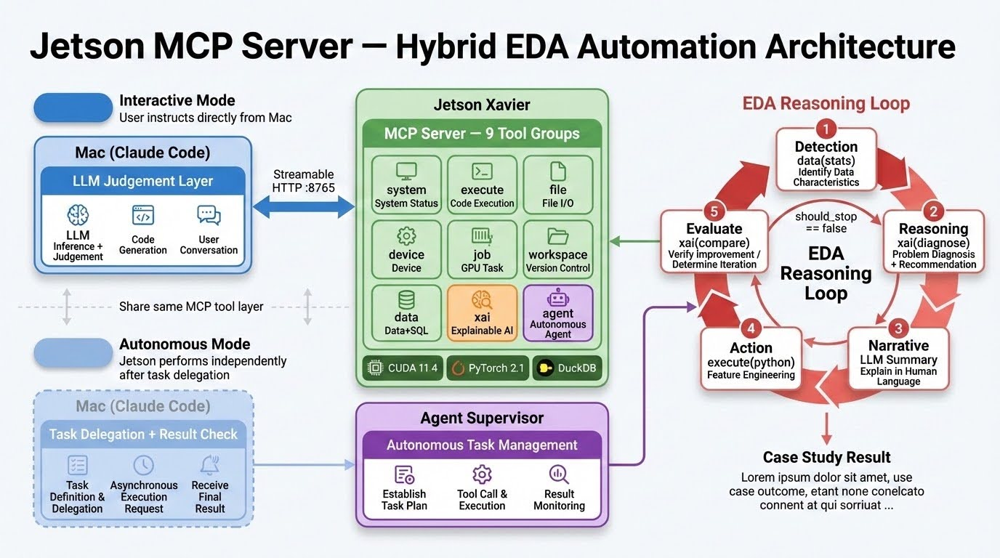

**English** | [한국어](README.ko.md)

# Jetson MCP Agent

An [MCP](https://modelcontextprotocol.io/) server + autonomous EDA agent that exposes NVIDIA Jetson Xavier's CUDA/GPU resources to [Claude Code](https://claude.ai/code) remotely. Features a hybrid architecture supporting both interactive mode (user-directed) and autonomous mode (AI agent-driven EDA).

## Architecture



**Hybrid design** — Two operational modes share the same 9 MCP tool groups:

- **Interactive mode**: Mac Claude Code remotely invokes Jetson MCP tools per user instructions (Streamable HTTP :8765)
- **Autonomous mode**: Delegate tasks via `agent(submit)` and Jetson's Claude Code CLI independently runs the EDA loop and records results

## EDA Reasoning Loop

The core value of this server is **iterative EDA automation**.

```
Detection ─── data(stats) to profile data characteristics
    ↓
Reasoning ─── xai(diagnose) to identify issues + recommend feature engineering
    ↓
Narrative ─── LLM summarizes diagnostics in natural language
    ↓
Action ────── LLM generates feature engineering code based on recommendations → retrain
    ↓
Detection ─── xai(compare) to verify improvement → iterate or stop
```

### Case Study: CNC Tool Wear Prediction

Validated on the University of Michigan CNC Mill dataset (17,520 rows, 48 sensors):

| Iteration | Features | Accuracy | Key Action |
|-----------|----------|----------|------------|
| **Iter 0** (Baseline) | 11 (raw) | 46.32% | Train on raw data as-is |
| `xai(diagnose)` | - | - | Detected 14 multicollinear pairs, 30 unused columns, class imbalance |
| **Iter 1** (Engineered) | 33 | 84.87% | Remove multicollinearity + StandardScaler + class_weight |
| **Iter 2** (Autonomous Agent) | - | **92.04%** | Remove experiment_id + one-hot encoding + BatchNorm+Dropout MLP |

**+45.72%p improvement** — The autonomous agent automatically detected data leakage, applied one-hot encoding, and added BatchNorm+Dropout.

## Why Two Python Versions?

JetPack dependency management is the key constraint.

| Runtime | Python | Reason |
|---------|--------|--------|
| **MCP Server** | 3.10 (venv) | MCP SDK requires `python >= 3.10` |
| **PyTorch/CUDA** | 3.8 (system) | NVIDIA JetPack R35.6.1 wheels are cp38-only |

Upgrading system Python (3.8) breaks the JetPack ↔ CUDA ↔ cuDNN ↔ TensorRT ↔ PyTorch dependency chain. **Do not change it.**

## Requirements

### Jetson Xavier
- JetPack R35.x (L4T R35)
- CUDA 11.4
- Python 3.8 (system) + Python 3.10 (`/usr/local/bin/python3.10`)
- PyTorch (installed via NVIDIA JetPack wheel for cp38)

### Client (Mac/Linux)
- [Claude Code](https://claude.ai/code) or any MCP client

## Quick Start

### 0. Configuration

Before deployment, open `deploy.sh` and **update the two variables at the top** for your environment:

```bash
# Top of deploy.sh
JETSON_HOST="YOUR_JETSON_IP"       # ← Jetson IP address
JETSON_USER="YOUR_USERNAME"        # ← Jetson username
```

Set up SSH key authentication beforehand:

```bash
ssh-copy-id <user>@<jetson-ip>
```

### 1. Deploy to Jetson

```bash
chmod +x deploy.sh
./deploy.sh
```

Or manually:

```bash
scp jetson_mcp_server.py requirements.txt <user>@<jetson-ip>:~/mcp-server/
ssh <user>@<jetson-ip>
cd ~/mcp-server
/usr/local/bin/python3.10 -m venv venv
venv/bin/pip install -r requirements.txt
venv/bin/python3 jetson_mcp_server.py --port 8765
```

### 2. Connect from Claude Code

```bash
claude mcp add jetson-xavier --transport streamable-http http://<jetson-ip>:8765/mcp
```

Or add to `.mcp.json`:

```json
{
  "mcpServers": {
    "jetson-xavier": {
      "type": "streamable-http",
      "url": "http://<jetson-ip>:8765/mcp"
    }
  }
}
```

### 3. Use in Claude Code

Just ask naturally:

- *"Check Jetson GPU status"*
- *"Analyze CNC sensor data"*
- *"Diagnose model training results with XAI"*

## Available Tools (9 Groups)

All tools support the `compact: bool` parameter (50-70% token reduction).

### 1. `system` — System Status
| Action | Description |
|--------|-------------|
| `info` | OS, CPU, memory, disk, uptime |
| `gpu` | CUDA/GPU status, tegrastats, JetPack version |
| `python` | Python versions, ML packages, CUDA status |
| `ping` | Health check |
| `processes` | Process list (filter supported) |

### 2. `execute` — Code Execution
| Action | Description |
|--------|-------------|
| `shell` | Shell command execution (with security blocking) |
| `python` | Python 3.8 + CUDA code execution |
| `benchmark` | CUDA matrix multiplication benchmark |

### 3. `file` — File I/O
| Action | Description |
|--------|-------------|
| `read` | Read file (binary detection, 1MB limit) |
| `write` | Write file (auto-creates directories) |

### 4. `device` — Device Management
| Action | Description |
|--------|-------------|
| `fan` | Get/set fan profile (quiet/cool/aggressive) |
| `install` | Install JetPack-compatible packages |
| `packages` | List compatible packages |

### 5. `job` — Async Job Queue
| Action | Description |
|--------|-------------|
| `submit` | Submit background job (automatic fan control) |
| `check` | Check job status / list all jobs |
| `result` | Retrieve completed job results |
| `log` | View execution logs |

### 6. `workspace` — Data Versioning
| Action | Description |
|--------|-------------|
| `init` | Initialize workspace |
| `status` | Current workspace status |
| `list` | List files |
| `fork` / `diff` / `info` / `delete` | Version management |

### 7. `data` — Data I/O + SQL Analytics
| Action | Description |
|--------|-------------|
| `upload` | Upload file from Mac → Jetson (text/base64) |
| `fetch` | Download data from URL |
| `stats` | Basic statistics (shape, dtypes, nulls, describe) |
| `query` | DuckDB SQL query |
| `ingest` | Load CSV/Parquet → DuckDB |

### 8. `xai` — Explainable AI + EDA Loop
| Action | Description |
|--------|-------------|
| `explain` | Comprehensive analysis (correlation + outliers + distribution + natural language summary) |
| `correlate` | Column correlation analysis (multicollinearity warnings) |
| `outliers` | IQR-based outlier detection + impact analysis |
| `profile` | Data profiling (distribution, skewness, missing patterns) |
| `trace` | Training result interpretation (loss/accuracy trends, confusion matrix, convergence check) |
| `diagnose` | **Training results + data characteristics diagnosis** (feature engineering recommendations) |
| `compare` | **Iterative training comparison** (accuracy trends, stopping decision) |

### 9. `agent` — Autonomous EDA Agent
| Action | Description |
|--------|-------------|
| `submit` | Submit new EDA task (background execution) |
| `status` | Check task status/progress |
| `result` | Retrieve completed task report |
| `list` | List all tasks |
| `cancel` | Cancel running task |

**Autonomous mode usage**:
```
"Delegate CNC data EDA to Jetson"
→ agent(submit, task="CNC EDA", dataset="raw/cnc_mill_real.csv")
→ Go grab a coffee
→ agent(result, task_id="agent_xxx") to check results
```

Jetson's Claude Code CLI autonomously invokes MCP tools and performs iterative EDA.
Stopping criteria: accuracy ≥95%, <1%p improvement for 2 consecutive iterations, or max 5 iterations.

## Fan Cooling Control

| Profile | Description | Use Case |
|---------|-------------|----------|
| `quiet` | Fan starts at 50°C, stops when idle | Idle / low load |
| `cool` | Fan starts at 35°C | Normal operation |
| `aggressive` | Fan always on, max speed at 50°C | AI training / inference |

`job(submit)` automatically switches to `aggressive` mode during execution and reverts on completion.

## Systemd Service

```bash
sudo systemctl status jetson-mcp    # Status
sudo journalctl -u jetson-mcp -f    # Logs
sudo systemctl restart jetson-mcp   # Restart
```

## Tested Environment

| Component | Version |
|-----------|---------|
| Jetson Xavier | AGX Xavier |
| JetPack | R35.6.1 |
| CUDA | 11.4 |
| cuDNN | 8.6.0 |
| TensorRT | 8.5.2 |
| PyTorch | 2.1.0a0+nv23.06 (cp38) |
| MCP SDK | 1.26.0 |
| Python (MCP) | 3.10.13 |
| Python (System) | 3.8.10 |

## Roadmap

- [x] 9 tool groups (system, execute, file, device, job, workspace, data, xai, agent)
- [x] XAI explainable AI layer
- [x] EDA iterative loop (diagnose → engineer → compare)
- [x] DuckDB SQL analytics engine
- [x] Async job queue + automatic fan control
- [x] Compact mode (50-70% token reduction)
- [x] Autonomous agent — Claude Code CLI hybrid architecture
- [ ] Model inference endpoints (ONNX, TensorRT)
- [ ] ESP32 IoT data pipeline

## Support

If you find this useful, consider buying me a coffee :)

[](https://ko-fi.com/beret21)

## License

MIT
